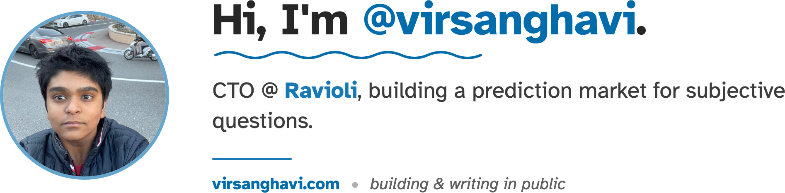

<!--
  Profile README for @VirSanghavi — designed to match virsanghavi.com
  Palette:  light #006cac on #fdfdfd   ·   dark #4ade80 on #050505
  Type:     Atkinson Hyperlegible (rendered into the banner image)
  Theme-aware via <picture> + #gh-*-mode-only. Banner source: assets/gen_banner.py
-->

<picture>
  <source media="(prefers-color-scheme: dark)" srcset="./assets/banner-dark.png">
  
</picture>

  
  &ensp;
  
  &ensp;
  
  &ensp;
  
  &ensp;
  
  &ensp;
  
  &ensp;
  

High-school founder out of Houston, Texas. I build AI products fast and write about the messy parts. Right now I'm CTO at **[Ravioli](https://ravioli.live)**, building a prediction market for subjective questions, and shipping a steady stream of smaller things in between.

  
  
  
  
  
  
  
  

---

### Start here

- **[Ravioli](https://ravioli.live)** &nbsp;·&nbsp; a prediction market for *subjective* questions, the ones without a clean yes/no answer. This is the main thing.
- **[Axis](https://github.com/VirSanghavi/axis)** &nbsp;·&nbsp; run AI coding agents in parallel: safely, efficiently, fast. My most-used open-source project.
- **[virsanghavi.com](https://virsanghavi.com)** &nbsp;·&nbsp; essays on building Ravioli, YC hackathons, and figuring it out in public.

### What I'm building

**Startups & products**
- **[Ravioli](https://ravioli.live)** &nbsp;·&nbsp; prediction market for subjective questions &nbsp;`web` `mobile`
- **[Axis](https://github.com/VirSanghavi/axis)** &nbsp;·&nbsp; orchestrate many AI coding agents in parallel without them stepping on each other
- **[vibesync](https://github.com/VirSanghavi/vibesync)** &nbsp;·&nbsp; creative-intelligence platform for short-form content teams

**AI & agents**
- **[arc](https://github.com/VirSanghavi/arc)** &nbsp;·&nbsp; an agentic swarm that builds startups, with the whole toolchain in one place
- **[gmail-agent](https://github.com/VirSanghavi/gmail-agent)** &nbsp;·&nbsp; autonomous Gmail responder on OpenAI + Apps Script that drafts context-aware replies right in your inbox, no backend
- **[savr](https://github.com/VirSanghavi/savr)** &nbsp;·&nbsp; phishing and social-engineering detection with machine learning

**Machine learning experiments**
- **[ML-celebrity-lookalike-scanner](https://github.com/VirSanghavi/ML-celebrity-lookalike-scanner)** &nbsp;·&nbsp; find which celebrity you look most like
- **[MLShirtColorDetector](https://github.com/VirSanghavi/MLShirtColorDetector)** &nbsp;·&nbsp; detect the color of someone's shirt from an image, running on macOS
- **[btc-usd-price-prediction](https://github.com/VirSanghavi/btc-usd-price-prediction)** &nbsp;·&nbsp; model BTC's recovery time back to $99k

**Study tools I built for myself**
- **[precalc](https://github.com/VirSanghavi/precalc)** &nbsp;·&nbsp; AP Precalculus prep with AI-graded FRQs scored against the real rubric
- **[whap](https://github.com/VirSanghavi/whap)** &nbsp;·&nbsp; AP World History: Modern prep with AI-graded, evidence-based essays

### Writing

- **[What I've been up to: a few months of building Ravioli in the open](https://virsanghavi.com/posts/building-ravioli-in-the-open.html)** &nbsp;·&nbsp; *31 May 2026 · 8 min*
- **[My experience attending two YC hackathons back-to-back](https://virsanghavi.com/posts/2-yc-hackathons-in-a-row.html)** &nbsp;·&nbsp; *02 Mar 2026 · 7 min*
- **[What I learned from WAC's Academic WorldQuest 2026](https://virsanghavi.com/posts/academic-worldquest-2026.html)** &nbsp;·&nbsp; *17 Feb 2026 · 3 min*
- **[Being Fifteen and Building Anyway](https://virsanghavi.com/posts/being-fifteen-and-building-anyway.html)** &nbsp;·&nbsp; *16 Feb 2026 · 3 min*
- **[What Getting Rejected from YC Twice Actually Feels Like](https://virsanghavi.com/posts/yc-rejection-and-building-stronger.html)** &nbsp;·&nbsp; *16 Feb 2026 · 6 min*

**[Read all posts →](https://virsanghavi.com/posts.html)**

### On GitHub

<picture>
  <source media="(prefers-color-scheme: dark)" srcset="https://github-readme-stats.vercel.app/api?username=VirSanghavi&show_icons=true&hide_border=false&include_all_commits=true&count_private=true&title_color=4ade80&icon_color=4ade80&text_color=eaedf3&bg_color=050505&border_color=166534">
  
</picture>
&nbsp;
<picture>
  <source media="(prefers-color-scheme: dark)" srcset="https://github-readme-stats.vercel.app/api/top-langs/?username=VirSanghavi&layout=compact&hide_border=false&langs_count=8&title_color=4ade80&text_color=eaedf3&bg_color=050505&border_color=166534">
  
</picture>

---

<a href="https://virsanghavi.com">virsanghavi.com</a> &nbsp;·&nbsp; building &amp; writing in public

